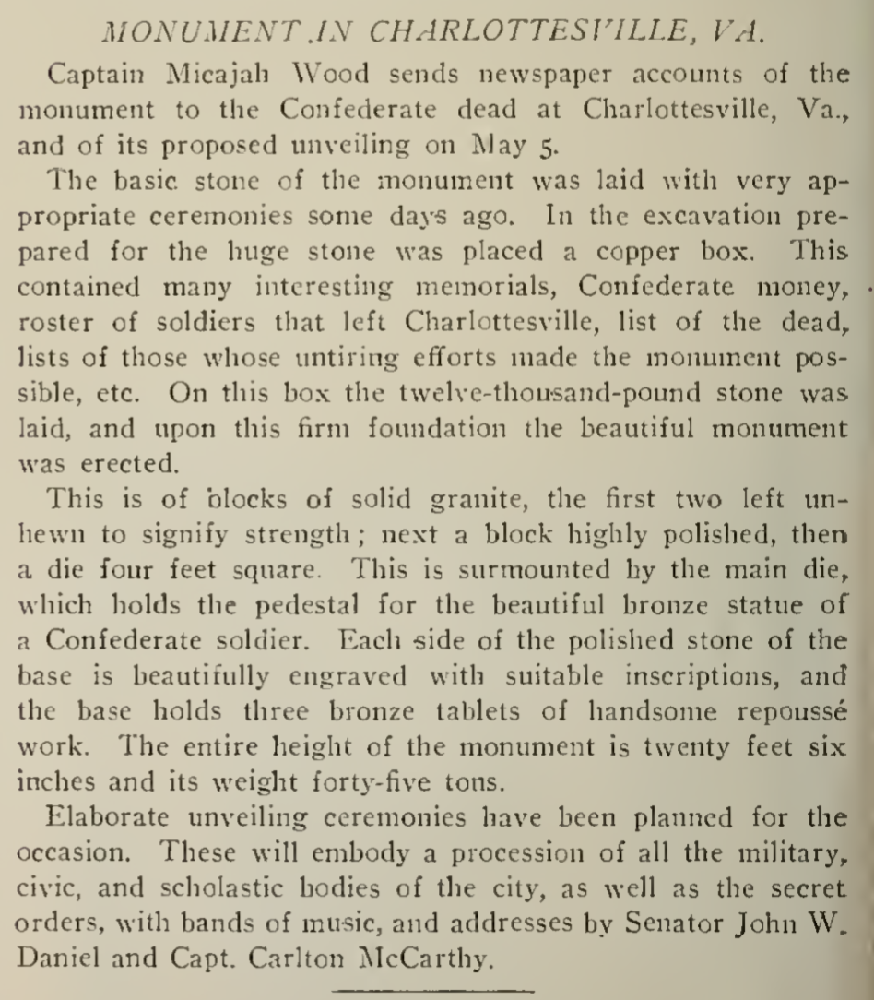
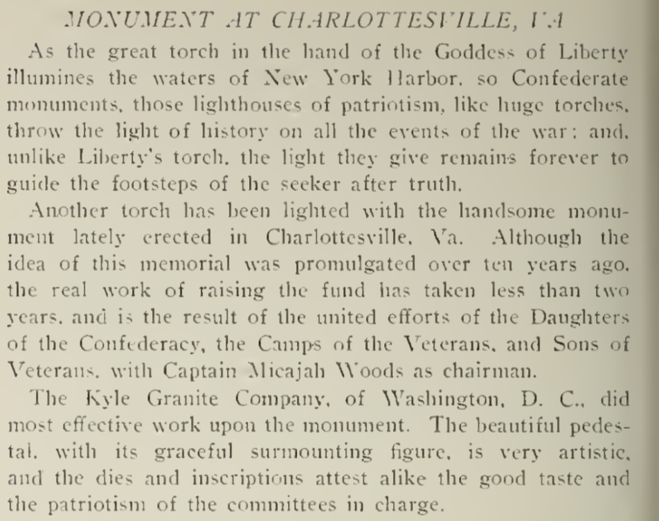
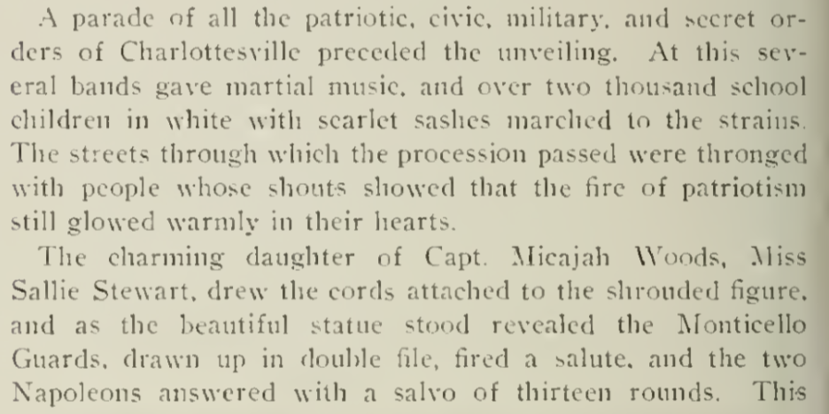
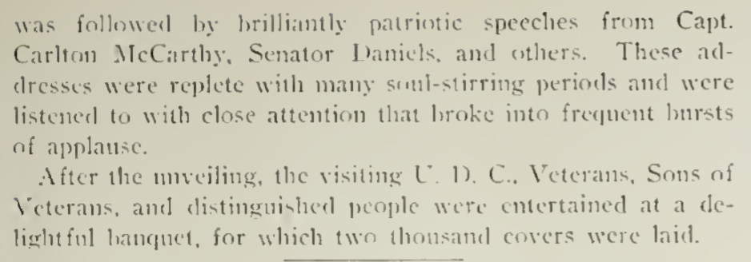
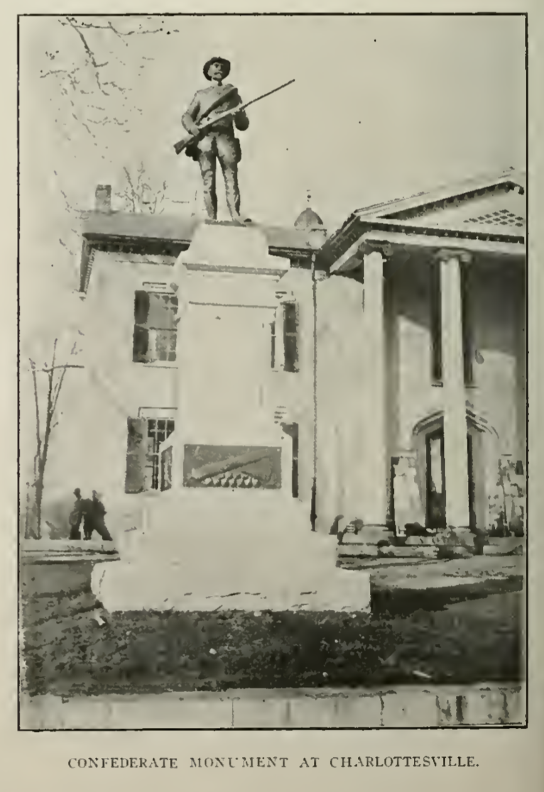
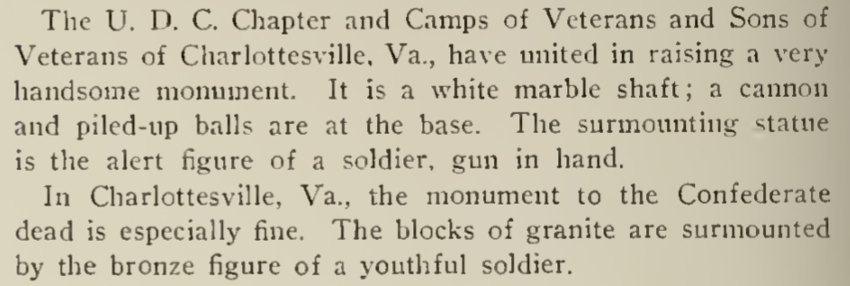

On May 5, 1909, the ... 

* ACHS document

1909 - 10 year effort culminates in Conf Soldier Monument

Confederate Soldier Memorial -- same year of disenfranchising VA Constitution

Confederate Monument at Albemarle County Courthouse unveiled.
Micajah Wood, then Albemarle Commonwealth's Attorney and ... was the chair. List members of committee. 

“Monument Is Unveiled Today”Daily Progress, 

May 5, 1909 https://search.lib.virginia.edu/catalog/uva-lib:2090743/view#openLayer/uva-lib:2090744/3286.5/2296/0/1/1

May 6 1909 https://search.lib.virginia.edu/catalog/uva-lib:2090752/view#openLayer/uva-lib:2090753/3290/2296/0/1/1

