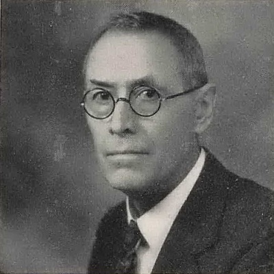
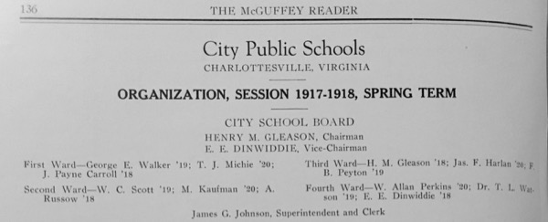

*Photo of James G. Johnson from 1943 Lane High Yearbook*

Johnson was born in Elk Garden, Russell County, Virginia, and later moved to Tennessee before returning to attend UVA. His father, Charles. W. Johnson, served in the Confederate States Army during the Civil War, then spent a single session at the UVA School of Medicine before becoming a physician.

Johnson received his Bachelor’s degree from [Milligan College](https://en.wikipedia.org/wiki/Milligan_College) in Tennessee, taught for seven years in Tennessee, then received his Doctorate in English from UVA in 1909. That same year, he became Superintendent of Schools for the racially-segregated Charlottesville public school system, holding that position until his retirement in 1946.

Johnson Elementary School was opened in 1954 as a primary school for white students living on the west side of the city.  The school is named for **Dr. James Gibson Johnson (1871-1957)​**, who served was Superintendent of Schools for the city from 1909 to 1946. Betty Davis Via, for whom Jackson-Via Elementary is partially named, was the school's first principal. 

In 1955, African American parents and students began formal challenges to the policy of racial segregation in Charlottesville city schools, leading to Federal court rulings ordering desegregation of Venable Primary and Lane High in 1959.  Johnson Elementary was desegregated in 1962, and all schools were integrated in the 1965-66 school year.  

*McGuffey Reader supplement, City Public School Organization 1917-18*

During his time as Superintendent, Johnson oversaw the construction of several school buildings, two of which are still in use as public schools and the others as cultural or local government facilities. When he started, Midway housed both the white primary and high schools (grades 1-11), and the original now-demolished Jefferson School building housed the Black primary school (grades 1-8), as there was no Black high school in the city and county.

Johnson's building program included McGuffey Primary (white, now McGuffey Arts Center), Venable Primary (white, now Elementary), George Rogers Clark School (white, now Elementary), Lane High (white, now the Albemarle County Office Building), improvements to the original Jefferson Elementary, and the first building for the new Jefferson High (Black, first section of what is now the Jefferson School City Center and location of the (Jefferson School African American Heritage Center).  One aspect of the segregated system in which he worked is the contrast between the grand, columned Venable School building, and industrial, utilitarian Jefferson High building, which were constructed within a few years of one another.

He worked tirelessly during his time as Superintendent, frequently being described as working to "exhaustion". This is evident from the numerous boxes of correspondence with the architects during the construction of Venable and renovation of Jefferson Elementary.  Writing on the topic of the construction of Venable School, he stated "during this period, I suppose I made several hundred thousand steps going to and coming from this site and walking around over it."

In 1936, he edited and contributed to a [detailed history](../johnson-history) of the Charlottesville schools and significant detail on the history of public schools in Virginia that was published as a supplement to the McGuffey Readers.  He also published volumes of student material from Venable (The Sentinel) and Clark (The Frontiersman) as McGuffey Reader supplements and an autobiography 1947. His voluminous school-related papers are in the UVA Library Special Collections.

## Resources

* Johnson, J. G. ​Education Pamphlets: Vol. 3.​ 1936. History of McGuffey school, 1915-1936. History of Venable school, 1922-1936. History of George Rogers Clark school, 1928-1936. https://search.lib.virginia.edu/catalog/u2722115
* *The Daily Progress*, Dr. Johnson, School Head 36 Years, Dies. June 21, 1957